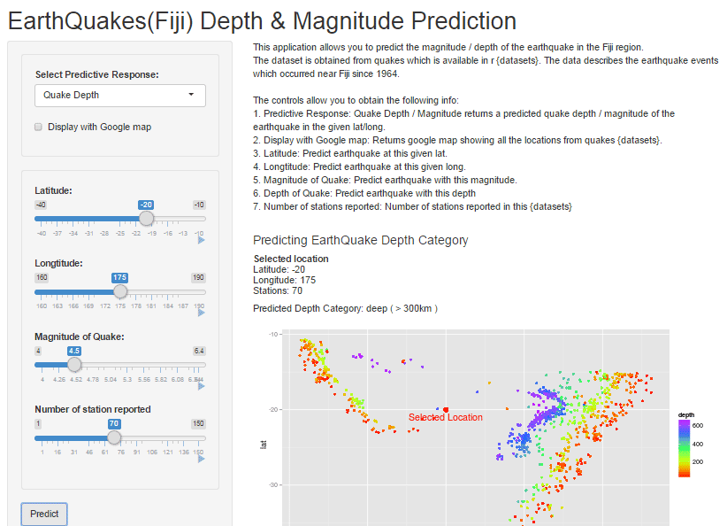
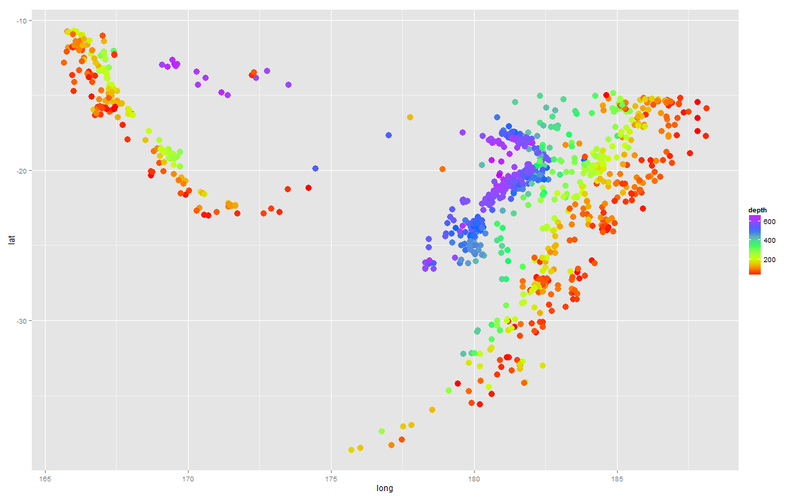
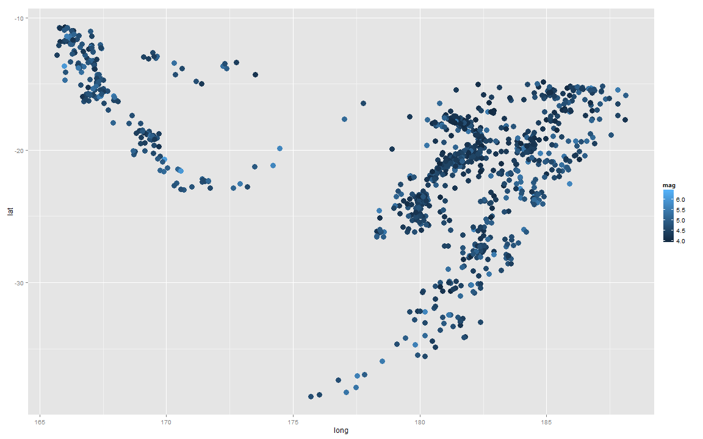

EarthQuake Prediction
========================================================
<br><br>
Author: BY Chia  
Date: April 21 2015

<small>
Coursera Data Science  
Developing Data Products<br/><br/>
<b><a href="https://bychia.shinyapps.io/EarthQuake/">Click for ShinyApp Project</a></b>
<br/>
</small>

***
<br>



ShinyApp Idea
========================================================

The idea allows users to predict the magnitude / depth of a predicted earthquake in the Fiji region.  
  
The dataset is obtained from **quakes** which is available in ***{datasets}*** package. The data describes the earthquake events which occurred near Fiji since 1964.
<small>

```r
str(quakes)
```

```
'data.frame':	1000 obs. of  5 variables:
 $ lat     : num  -20.4 -20.6 -26 -18 -20.4 ...
 $ long    : num  182 181 184 182 182 ...
 $ depth   : int  562 650 42 626 649 195 82 194 211 622 ...
 $ mag     : num  4.8 4.2 5.4 4.1 4 4 4.8 4.4 4.7 4.3 ...
 $ stations: int  41 15 43 19 11 12 43 15 35 19 ...
```
</small>


ShinyApp Controls
========================================================
The  controls allow you to predict based on :
<small>
- Predictive Response: Quake Depth / Magnitude returns a predicted quake depth / magnitude of the earthquake in the given lat/long.<br />
- Display with Google map: Returns google map showing all the locations from ***quakes datasets***.<br />
- Latitude: Predict earthquake at this given lat.<br />
- Longtitude: Predict earthquake at this given long.<br />
- Magnitude of Quake: Predict earthquake with this magnitude.<br />
- Depth of Quake: Predict earthquake with this depth.<br />
- Number of stations reported<br />
</small>


EarthQuake sites by Depth (km)
========================================================


 

EarthQuake sites by Magnitude
===
 
